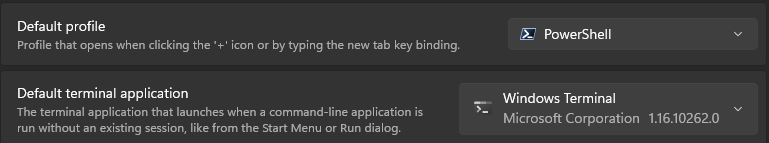
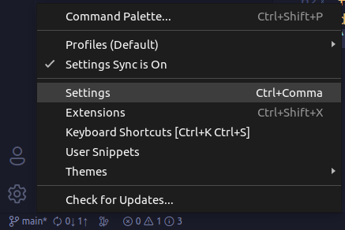

# My shell setup


I'm super excited to share with you my awesome shell setup that makes my coding life so much easier and fun! 😍

All you need to do is clone this repo and run appropriate script. It will install everything you need in a snap (excluding terminal and nerd font).

Features:

- Command Completion with [PSReadLine](https://github.com/PowerShell/PSReadLine) and [PowerType](https://github.com/AnderssonPeter/PowerType)
- sudo on windows using [gsudo](https://github.com/gerardog/gsudo)
- Beautiful Prompt Using [starship](https://starship.rs)
- Icons for `Get-ChildItem` and it's aliases (`dir` or `ls`) using [Terminal-Icons](https://github.com/devblackops/Terminal-Icons)

## Installation

### Windows

Run windows.bat

### Linux

#### Ubuntu

```bash
bash ./ubuntu.sh
```

Note: Only Ubuntu LTS and it's derivatives is supported.

#### Fedora/Alma Linux/RHEL/CentOS

```bash
bash ./fedora.sh
```

### Mac

Warning: This script isn't tested! I don't have a mac.

```bash
bash ./mac.sh
```

## Updating

use `git pull` and re-run appropriate script.

## Terminal Setup Instruction

You need to use one of these terminals: [Supported Terminals](https://github.com/tonsky/FiraCode#terminal-compatibility-list) You also need to use a [nerd font](https://www.nerdfonts.com/font-downloads). Trust me, you will love the icons and glyphs. 😎 Remember to set the nerd font and powershell as your default shell in your terminal. I'm showing setup instruction for Windows Terminal, Hyper and Visual Studio Code Integrated Terminal below.
I'm using Cascadia Code Nerd Font as example.

### Windows Terminal

Windows Terminal > Click on the arrow > Settings


Set PowerShell as default shell and Windows Terminal as default terminal like below.



Go to Default > Appearance > Set your nerd font as default

Restart terminal

### Hyper

Hyper>Edit>Preferences


Add the following to your hyper.js file

```javascript
module.exports = {
  config: {
    // Uncomment below for Linux/Mac
    // shell: '/usr/bin/pwsh',
    // Uncomment below for Windows
    // shell: 'C:\\Program Files\\PowerShell\\7\\pwsh.exe'
    fontFamily: "CaskaydiaCove Nerd Font Mono",
    disableLigatures: false,
  },
};
```

### Visual Studio Code Integrated Terminal

Click on the gear icon> Settings


Click Open settings.json icon.


Add the following code in your settings.json file.

```json
{
  "terminal.integrated.defaultProfile.windows": "PowerShell",
  "terminal.integrated.defaultProfile.linux": "pwsh",
  "terminal.integrated.defaultProfile.osx": "pwsh",
  "terminal.integrated.shellIntegration.suggestEnabled": true,
  "editor.fontFamily": "CaskaydiaCove Nerd Font Mono"
}
```
